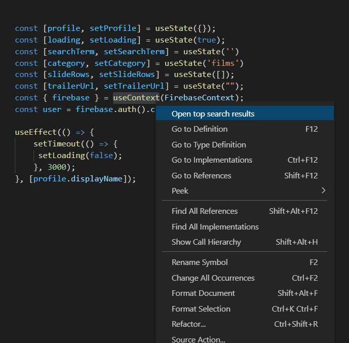
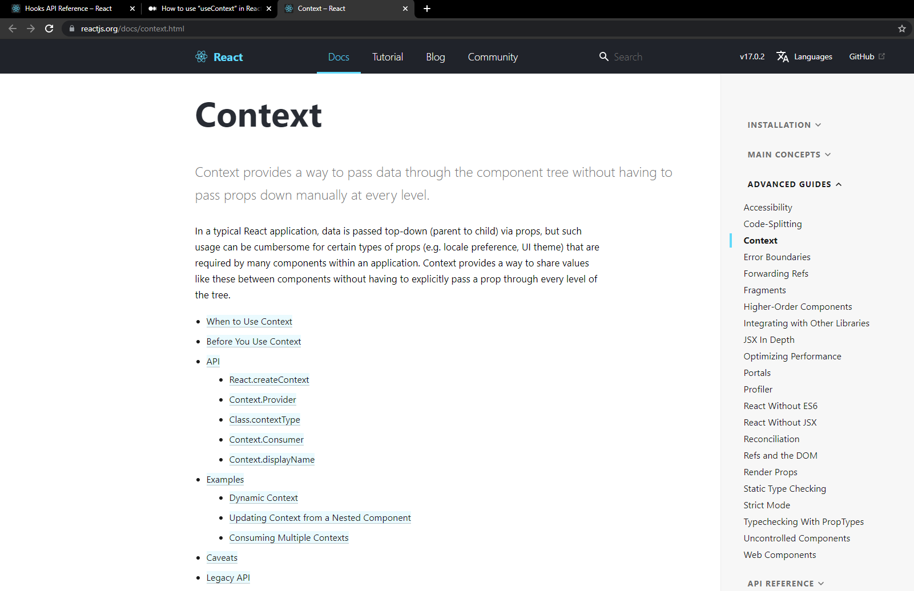

# Top Search Results

A simple extension to search and open top search results, directly from VSCode .

## What it does

Now search directly from VSCode and you'll be redirected to top 3 search results, indexed from handpicked top resources all around the web. 

## How it works

Simply select the word or function you want to search, then right click and click on `Open top search results` in drop-down menu.

 

## Showing top search results ----

### If you encounter any issues, please mail: gaur.rajdeep95@gmail.com

-----------------------------------------------------------------------------------------------------------

**Enjoy!**
